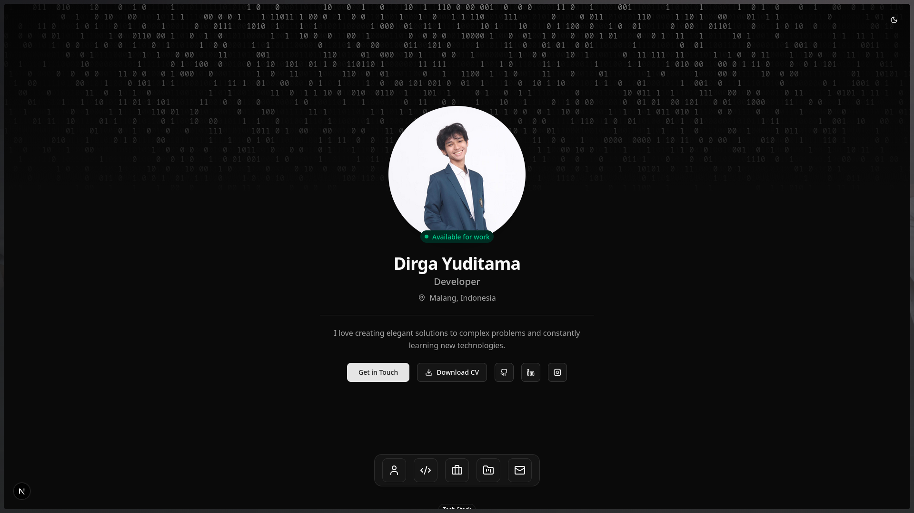
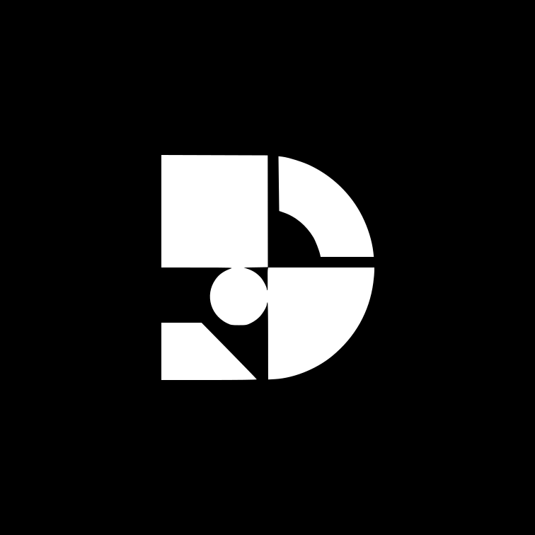

<div>
  
  
</div>

# Portfolio Website v2.0 🚀

A modern, responsive portfolio website built with **Next.js**, **TypeScript**, and **Shadcn UI**. Showcase your projects, skills, and experience with a beautiful, animated interface.

## ✨ Features

- 🎨 **Modern UI/UX** - Beautiful design with smooth animations and transitions
- 🌓 **Dark/Light Mode** - System-aware theme switching with persistence
- 📱 **Fully Responsive** - Optimized for all devices and screen sizes
- 🎭 **Smooth Animations** - Powered by Framer Motion for fluid interactions
- 🖥️ **macOS-style Dock** - Interactive navigation dock with hover effects
- 🎬 **Splash Screen** - Animated terminal-style loading screen
- 📊 **Tech Stack Showcase** - Interactive carousel and categorized overview
- 💼 **Experience Timeline** - Visual timeline of work experience
- 🎯 **Project Showcase** - Dynamic project pages with detailed information
- 📧 **Contact Form** - Functional contact form with validation
- 🔍 **SEO Optimized** - Built-in sitemap and metadata optimization
- ⚡ **Performance** - Fast loading with Next.js App Router and static generation

## 🛠️ Tech Stack
`
  

- **Framework**: 
- **Language**: 
- **UI Library**:  
- **Styling**: 
- **UI Components**: 
- **Animations**: 
- **Icons**:  + 
- **Deployment**: 

## 📁 Project Structure

```
portfolio-v2.0/
├── app/              # Next.js pages & routes
├── components/       # React components
│   ├── blocks/      # Reusable UI blocks
│   ├── layout/      # Layout components
│   ├── sections/    # Page sections
│   └── ui/          # Shadcn UI components
├── lib/             # Utilities & data
└── public/          # Static assets
```

## 📄 License

MIT License - feel free to use this project for your own portfolio!

## 👨‍💻 Author

**Dirga Yuditama**
- GitHub: [dirgaydtm](https://github.com/dirgaydtm)
- LinkedIn: [dirgaydtm](https://linkedin.com/in/dirgaydtm)
- Website: [dirga.site](https://dirga.site)